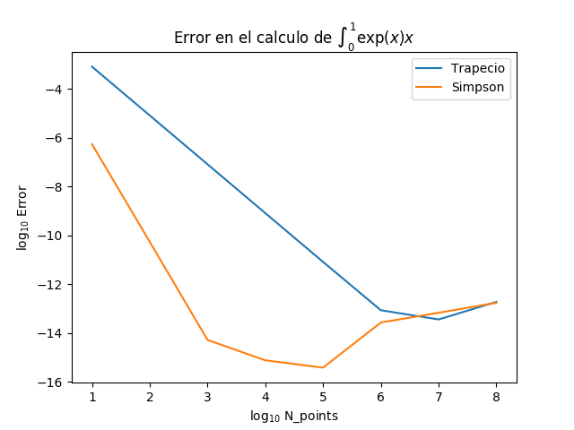

Escriba en python una implementación del algoritmo de Simpson para integrar una funcion arbitraria.


```python
import numpy as np

def simpson(f, a, b, N):
    h = (b-a)/(N-1)
    suma = 0.0
    for i in range(1,N-1,2):
        x = a + i * h 
        suma += (1.0/3.0) * (f(x-h) + 4*f(x) + f(x+h)) * h
    return suma
```

Escriba una funcion que pueda elegir entre el algoritmo del trapecio o Simpson para hacer una integral.

```python
def integra(f, a, b, N, algo="trapecio"):
    if algo == "trapecio":
        return trapecio(f,a,b,N)
    elif algo == "simpson":
        return simpson(f,a,b,N)
```

Para la integral de exp(x) entre 0 y 1 haga una grafica del error fraccional como funcion del numero de puntos. Tanto el error como el numero de puntos deben variar en escala logaritmica.


```python
import matplotlib.pyplot as plt

n_iteration = 8
log_n_points = np.arange(1,1+n_iteration, dtype=int)
frac_error_trapecio = np.zeros(n_iteration)
frac_error_simpson = np.zeros(n_iteration)
analitico = np.exp(1) - 1.0

for i in range(n_iteration):
    n_points  = 10**log_n_points[i]
    print(n_points)

    numerico = integra(np.exp, 0.0, 1.0, n_points+1, algo="trapecio")
    frac_error_trapecio[i] = abs((analitico-numerico)/analitico)

    numerico = integra(np.exp, 0.0, 1.0, n_points+1, algo="simpson")
    frac_error_simpson[i] = abs((analitico-numerico)/analitico)
    
plt.plot(log_n_points, np.log10(frac_error_trapecio), label='Trapecio')
plt.plot(log_n_points, np.log10(frac_error_simpson), label='Simpson')
plt.xlabel('$\log_{10}$ N_points')
plt.ylabel('$\log_{10}$ Error')
plt.title("Error en el calculo de $\int_0^1\exp(x)\d x$")
plt.legend()
plt.savefig('error.png')
```



Bono: Calcule la ley de potencia con la que el error decrece en los dos algoritmos.

    

