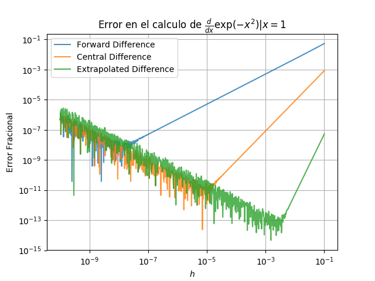

* Escriba en python un programa que implemente los esquemas de diferenciacion
Forward Difference, Central Difference y Extrapolated Difference.

* Calcule el error fraccional como funcion de h para la derivada de `exp(-x**2)` evaluada en `x=1`

```python
import numpy as np
import matplotlib.pyplot as plt

def deriva(f, x, h, metodo=""):
    if metodo=="FD":
        return ( f(x+h) - f(x) ) /h
    elif metodo=="CD":
        return ( f(x+h/2) - f(x-h/2) ) /h
    elif metodo=="ED":
        return (8 * (f(x+h/4) - f(x-h/4)) - (f(x+h/2)-f(x-h/2)))/3/h
    else:
        print("Metodo {} no ha sido implementado".format(metodo))
        
def funcion(x):
    return np.exp(-x*x)

def analitica(x):
    return -2.0*x*np.exp(-x*x)

n_points = 1000
h = np.logspace(-10,-1,n_points)
x = 1.0

fd = deriva(funcion, x, h, metodo="FD")
cd = deriva(funcion, x, h, metodo="CD")
ed = deriva(funcion, x, h, metodo="ED")


plt.loglog(h, np.abs((fd-analitica(x))/ analitica(x)), label="Forward Difference", alpha=0.8)
plt.loglog(h, np.abs((cd-analitica(x))/ analitica(x)), label="Central Difference", alpha=0.8)
plt.loglog(h, np.abs((ed-analitica(x))/ analitica(x)), label="Extrapolated Difference", alpha=0.8)
plt.legend()
plt.grid()
plt.title('Error en el calculo de $\\frac{d}{dx}\exp(-x^2)|x=1$')
plt.xlabel('$h$')
plt.ylabel('Error Fracional')
plt.savefig("deriva.png")

```



BONO. Encuentre la pendiente con la que aumenta el error con h en la region que no esta dominada por el error numerico.


