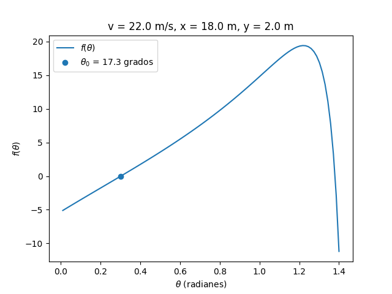

* Escriba en python un programa que encuentre el ángulo al que debe ser enviado un proyectil con posición inicial en el origen del sistema de coordenadas para que pase por un punto de coordenadas `(x,y)` fijas.
El programa debe llamarse como `def apunta(v, x, y):` donde `v` es la rapidez inicial, `x` es la posicion deseada en x y `y` es la posicion deseada en y.

```python
import numpy as np
import matplotlib.pyplot as plt

def func(v, x, y, theta):
    g = 9.8
    f = x * np.tan(theta) - 0.5*g*(x/(v*np.cos(theta)))**2
    return f-y

def deriva_func(v, x, y, theta, epsilon=0.01):
    d = func(v, x, y, theta+epsilon) - func(v, x, y, theta-epsilon) 
    d = d/(2.0*epsilon)
    return d

def apunta(v, x, y, n_iter=1000, epsilon=1E-6):
    theta = 0.0
    i = 0
    while (i<n_iter) & (np.abs(func(v,x,y,theta)) > epsilon):
        theta = theta - func(v,x,y,theta)/deriva_func(v,x,y,theta)
        i = i + 1     
    return theta

# Solamente lo que esta arriba de este comentario era necesario,
# lo que viene abajo es para la visualizacion.

v = 22.0
x = 18.0
y = 2.0

theta_0 = apunta(v,x,y)
theta = np.linspace(1E-2, 1.4, 100)

parametros = "v = {:.1f} m/s, x = {:.1f} m, y = {:.1f} m".format(v,x,y)
solucion = "$\\theta_0$ = {:.1f} grados".format(np.rad2deg(theta_0))

# Grafica para verificar el cero de la funcion
plt.figure()
plt.plot(theta, func(v, x, y, theta), label="$f(\\theta)$")
plt.scatter(theta_0, func(v,x,y, theta_0), label=solucion)
plt.title(parametros)
plt.xlabel('$\\theta$ (radianes)')
plt.ylabel('$f(\\theta)$')
plt.legend()
plt.grid()
plt.savefig('apunta.png')

# Grafica para verificar la trayectoria
plt.figure()
rangex = np.linspace(0.0, x)
rangey = func(v, rangex, y, theta_0) + y
plt.plot(rangex, rangey, label="trayectoria")
plt.scatter(x, y, label="meta")
plt.xlabel("x (metros)")
plt.ylabel("y (metros)")
plt.title(parametros)
plt.legend()
plt.grid()
plt.savefig('trayectoria.png')

```




