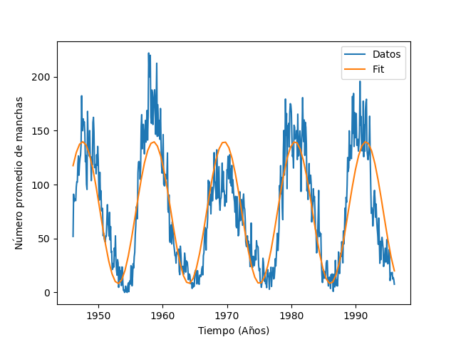

* Escriba en python un programa que encuentre los parametros que mejor ajustan los datos `monthrg.dat` usando la funcion discutida en clase.

```python
import numpy as np
import matplotlib.pyplot as plt

data = np.loadtxt('monthrg.dat')
year = data[:,0]
month = data[:,1]
days = data[:,2]
manchas = data[:,3]

ii = (days>0) & (year>1945)
manchas = manchas[ii]
t = year[ii] + month[ii]/12.0 

n_points = len(t)

A = np.transpose(np.array([np.cos(t*np.pi*2/11), -np.sin(t*np.pi*2/11), np.ones(n_points)])) 
y = np.transpose(manchas) 

new_A = np.dot(np.transpose(A), A)
new_y = np.dot(np.transpose(A), y)
solucion = np.linalg.solve(new_A, new_y)

best_t = np.linspace(t.min(), t.max(), 100)
best_y = solucion[0] * np.cos(best_t*np.pi*2/11) - solucion[1] * np.sin(best_t*np.pi*2/11) + solucion[2]

plt.figure()
plt.plot(t, manchas, label="Datos")
plt.plot(best_t, best_y, label="Fit")
plt.xlabel(r"$\mathrm{Tiempo\ (A\~nos)}$")
plt.ylabel(r"$\mathrm{N\'umero\ promedio\ de\ manchas}$")
plt.legend()
plt.savefig('solar.png')

```




