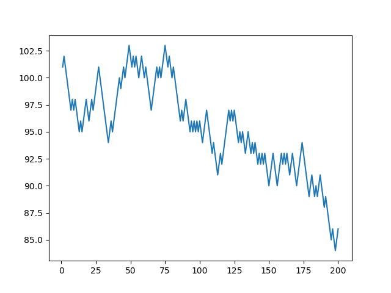

Escriba tres scripts de python para resolver los siguientes ejercicios.

1. Haga una gráfica de la espiral de Arquímedes (https://en.wikipedia.org/wiki/Archimedean_spiral)

```python
import numpy as np
import matplotlib.pyplot as plt

n_points = 10000
n_vueltas = 4

theta = np.linspace(0.0, n_vueltas * 2.0 * np.pi, n_points)
r = 1.0 + theta

x = r * np.sin(theta)
y = r * np.cos(theta)

plt.plot(x,y)
plt.savefig('espiral.png')
```


2. En un juego de cara y sello, donde la probabilidad de sacar cara es 0.49 y la de sacar sello es 0.51, decido apostar
con mi contrincante 1 peso por cada vez que yo saque sello. Es decir, si sale sello él me da 1 peso y si sale cara yo le doy 1 peso.
El juego termina si uno de los dos queda con cero pesos. Ambos empezamos con 100 pesos. El script debe calcular el dinero que tengo luego de tirar la moneda 'n' veces. Al final hacer una gráfica de la cantidad de dinero en función de `n` para `1<n<200`. 

```python
import numpy as np
import matplotlib.pyplot as plt

mi_plata = 100
n_apuestas = 0

plata = []
apuestas = []
while (n_apuestas < 200 and mi_plata >0 and mi_plata <=200 ):
    n_apuestas += 1 
    r = np.random.random()
    if(r<=0.51):
        mi_plata +=1
    else:
        mi_plata -=1
    plata.append(mi_plata)
    apuestas.append(n_apuestas)

plt.plot(apuestas, plata)
plt.savefig('apuestas.png')
```




3. Calcule la probabilidad de que al menos 2 personas cumplan años el mismo día entre un grupo de `n` personas. Haga una gráfica de esta probabilidad como función de `n` para `2<n<100`.

```python
import numpy as np
import matplotlib.pyplot as plt

def coincide(n_gente):
    """
    Calcula si hay coincidencias en conjunto
    aleatorio de dias de cumpleanos de n_gente
    
    Devuelve 1 si hay coincidencia, 0 si todos
    los dias de cumple son unicos
    """

    dias_cumple = np.random.randint(0,high=365, size=n_gente)
    dias_unicos = len(np.unique(dias_cumple))
    if(dias_unicos < n_gente):
        coincidencia = 1
    else:
        coincidencia = 0
    return coincidencia

def coincide_fraccion(n_gente, n_intentos=10000):
    """
    Calcula la probabilidad frecuentista de
    tener dentro de un grupo con n_gente personas 
    coincidencias en el dia del cumple.
    Para esto se generan n_intentos de estos grupos
    y se cuenta la fraccion final que tiene coincidencias.
    """
    n_coincide = 1.0
    for i in range(n_intentos):
        n_coincide += coincide(n_gente)
    return n_coincide/n_intentos

n_gente = []
proba_coincide = []
for i in range(2,200):
    n_gente.append(i)
    proba_coincide.append(coincide_fraccion(i))
    print(i)

plt.plot(n_gente, proba_coincide)
plt.savefig('coincide_cumple.png')
```


