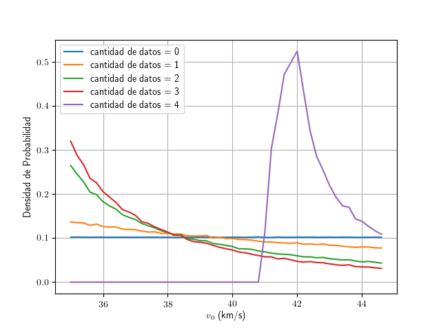

resultados: [ 61 115  31 177] +/- 5.0
prior: 35 - 45 

```python
import numpy as np
import matplotlib.pyplot as plt

def alcance(v, theta):
    g = 9.8
    return v**2 * np.sin(2*theta)/g

n_puntos = 10000000
d_obs = np.array([61, 115, 31, 177])
sigma_d = 5.0

v_prior = np.random.uniform(35.0,45.0, n_puntos)
theta_prior = np.random.uniform(0, np.pi/2.0, n_puntos)

prior = {}
prior[0] = v_prior

for i in range(len(d_obs)):
    d = alcance(v_prior, theta_prior)    
    ii = (d > d_obs[i]-sigma_d) & (d < d_obs[i]+sigma_d)
    v_posterior = v_prior[ii]
    v_prior = np.random.choice(v_posterior,n_puntos)
    theta_prior = np.random.uniform(0, np.pi/2.0, n_puntos)
    prior[i+1] = v_prior


plt.figure()
plt.rc('text', usetex=True)

for i in range(len(d_obs)+1):
    hist, edges = np.histogram(prior[i], bins=np.arange(35,45,0.2), density=True)
    plt.plot(edges[:-1], hist, label='cantidad de datos = {}'.format(i))

plt.xlabel(r"$v_0$ (km/s)")
plt.ylabel("Densidad de Probabilidad")
plt.grid()
plt.legend()
plt.savefig("bayes.png")

```




La respuesta es, como era de esperarse, [42](https://en.wikipedia.org/wiki/42_(number)).
